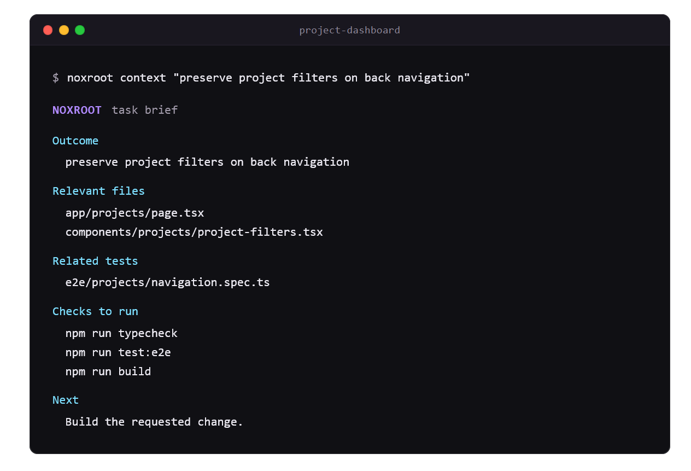

<p align="center">
  
</p>

<p align="center">
  <a href="https://github.com/liolevx/noxroot/actions/workflows/ci.yml"></a>
  <a href="https://www.npmjs.com/package/noxroot"></a>
  <a href="LICENSE"></a>
</p>

# Noxroot

**Give coding agents the project context they need, then check what they changed.**

A CLI for project memory, focused task briefs, approved checks, and reusable documentation.

Noxroot carries repository knowledge across sessions, prepares a small task brief, checks the
resulting diff with approved commands, and proposes useful documentation for the next task.

It reuses the docs, rules, skills, and checks your repository already has. Use it with Codex, Claude
Code, Cursor, OpenCode, Copilot CLI, and other coding agents.

## What Noxroot changes

| Without Noxroot                                        | With Noxroot                                                                        |
| ------------------------------------------------------ | ----------------------------------------------------------------------------------- |
| Each new session rediscovers the repository            | Every task starts from the same documented project knowledge                        |
| Too much code is loaded or an important file is missed | The agent gets a small, explainable task brief                                      |
| Checks are guessed, skipped, or reported vaguely       | Approved checks run against the actual diff                                         |
| Decisions and fixes disappear into old chats           | Useful lessons are proposed as Markdown and carried into future tasks once accepted |
| The workflow depends on one coding tool                | The core works through a CLI, Markdown, JSON, and a command adapter                 |

Example task brief:

<p align="center">
  
</p>

## Project memory, not chat history

Project memory is the versioned repository knowledge future agents should reuse: architecture,
conventions, decisions, procedures, and validated lessons. It is stored as ordinary Markdown, not
model memory or chat history.

Noxroot starts with the repository's existing documentation and source. Its index points agents to
relevant material instead of copying it into a parallel wiki. Validated lessons keep project
documentation current. If no reusable lesson exists, nothing is added. Completed local run evidence
expires after the configured retention window and is capped by count. Active and incomplete work is
preserved.

Read project knowledge in GitHub, your editor, or Obsidian. It excludes raw prompts, application
sessions, credentials, and user data.

## Checks that match the change

During setup, Noxroot looks for existing lint, type-check, test, build, and native eval commands.
Legacy or custom commands may need explicit configuration. You approve which may run. `finish`
applies the relevant checks to the changed paths. Wider or sensitive changes can require independent
review.

Noxroot shows which files changed, which commands ran, what passed or failed, and anything it could
not verify. A missing relevant check produces `incomplete`, never `approved`. Inspect the exact plan
before it runs with `noxroot verify --plan`.

## Set up once

Requires Node.js `>=22.12 <27` and npm. From your repository directory, inspect the proposed setup:

```bash
npx noxroot@latest preview
```

When ready, initialize once:

```bash
npx noxroot@latest init
```

Commit the reviewed setup before your first code-changing task; `start` requires a clean Git
baseline. This is a local commit; no push is needed. Still evaluating? `preview` and `context` work
without initialization or a setup commit.

Then keep talking to your coding agent normally. For code changes, compatible agents are instructed
to run the pinned `start` before editing and `finish` afterward.

Finish all edits, run `finish`, address any failures or required review, then commit. Rerun `finish`
if you edit again. Approve real project commands during setup; see the
[first-task guide](docs/getting-started.md) for missing checks, timeouts, and package-age
restrictions.

`init` preserves existing documentation and pins the Noxroot version. `npx` downloads from
[npm](https://www.npmjs.com/package/noxroot) into its cache; no global installation or clone is
needed.

Preview labels capabilities `create`, `reuse`, `adjacent`, `conflict`, or `not-assessed`. Noxroot
fills confirmed gaps; existing systems stay in place. Another development coordinator keeps
ownership of lifecycle, review, and learning; Noxroot can supply context and verification alongside
it. A coordination ledger is adjacent, not a development coordinator. Noxroot does not import its
log.

Read-only work creates no task. In the same repository, branch, and worktree, a repeated `start`
continues the active baseline. `finish` infers a single matching task; several matches require
`--task <id>`. Commands remain available for manual use when an agent does not follow the
instructions.

When upgrading, inspect the managed instruction changes with
`npx noxroot@latest sync --dry-run --diff`. Apply them with `npx noxroot@latest sync` after review.
Starting a new chat does not require an upgrade or another initialization. See the
[command reference](docs/commands.md) for manual tasks and sync limits.

### What setup can add

| Surface                           | Actual path or command                                                                                      | Purpose                                                                  |
| --------------------------------- | ----------------------------------------------------------------------------------------------------------- | ------------------------------------------------------------------------ |
| Agent entrypoint and config       | `AGENTS.md`, `.noxroot/config.yml`                                                                          | Connect compatible agents to the project workflow                        |
| Project-memory index              | `.noxroot/knowledge/INDEX.md`                                                                               | Route agents to relevant existing documentation                          |
| Task-context routes               | `.noxroot/routes.yml`                                                                                       | Select relevant files, rules, tests, decisions, and skills               |
| Verification policy and skill     | `.noxroot/verification.yml`, `.noxroot/skills/verify-change/SKILL.md`                                       | Define approved checks and the procedure for checking a change           |
| Review skills                     | `.noxroot/skills/independent-review/SKILL.md`, `.noxroot/skills/product-ux-review/SKILL.md` when applicable | Provide fresh review procedures when the change requires them            |
| Learning procedure after finish   | `finish`, then `learn` through the pinned `npx` command                                                     | Propose a small knowledge update when something reusable was validated   |
| Local task state created by start | `.noxroot/local/runs/*.json` in a new Git checkout                                                          | Store ignored baselines and results, separate from project documentation |

Only missing capabilities are proposed. Mature repositories may need nothing. Existing documentation
remains discoverable without being copied.

Existing `.git/noxroot` records stay in place, without a second store. If an agent cannot write task
state, it must stop and request access before continuing.

`SKILL.md` files are portable instructions for verification and review. `AGENTS.md`, the knowledge
index, and routes guide context loading. `finish` and `learn` handle learning proposals.

Skills are instructions, not test evidence. Incomplete work cannot become approved. Noxroot does not
push, merge, publish, or deploy.

`context "<task>"` is read-only. It does not start a task or run checks. Selection is advisory, not
permission to edit. "Do not deploy" remains an exclusion; it never activates deployment work. Use
`start` to record the task baseline and `finish` to check the resulting change.

Large files get bounded line ranges when relevant text is found. Partial context is labelled; agents
still inspect the surrounding code. Existing routes stay unchanged.

## Preview example

`preview` reports what Noxroot found and what setup would add. Use `preview --diff` to inspect the
proposed patches before writing anything.

<details>
<summary>See a sample preview and run it from source</summary>

To try Noxroot from source, use Node.js `>=22.12 <27`:

```bash
git clone https://github.com/liolevx/noxroot.git
cd noxroot
npm ci
npm run build
node dist/cli.js preview --root tests/fixtures/typescript
```

The fixture produces this abbreviated output:

```text
NOXROOT  preview

Detected
  Node.js · TypeScript · npm

Mode
  Full

Add
  Project knowledge
  Task routes
  Verification
  Verification skill
  Task orchestration

Not assessed
  Product and UX guidance

No files changed. No project commands or agents ran. No network requests were made.

Next
  npx --yes noxroot@0.1.0 preview --diff
```

</details>

For local development and validation commands, see [Development](docs/development.md).

## Portable by design

Noxroot's universal interface is the CLI plus generated Markdown and JSON. Any agent that can run a
command or read a task package can use it. The generic adapter accepts an explicit executable and
literal arguments. It does not guess vendor flags or use shell interpolation.

Instruction discovery varies by client. Native integration is not identical across tools.

Application-agent frameworks are detected project architectures, not competitors or dependencies.
Their tests and evals can become approved repository checks. Noxroot does not install or control
Agno, PydanticAI, Google ADK, LangGraph, or another application runtime. Project knowledge remains
separate from application runtime sessions, state, memory, and user data.

JavaScript package evidence supports npm, pnpm, Yarn, and Bun. Explicit verification arrays support
Python, Go, Rust, and other stacks. CI covers Windows, macOS, and Linux.

## Inspect the details when you need them

`--verbose` shows detailed human-readable evidence. `preview --diff` shows proposed writes.
`context` explains file selection. `verify --plan` shows approved commands without running them.
`verify --changed` runs applicable checks. `run --dry-run` shows a connected execution plan.
`status` shows active work and the next action. `doctor` explains configuration problems.
`learn --task ID` shows confirmable durable proposals. Data commands support `--json`, with progress
and diagnostics on standard error.

Read [Getting started](docs/getting-started.md), the [command reference](docs/commands.md),
[configuration](docs/configuration.md), [architecture](docs/architecture.md),
[adapter protocol](docs/adapters.md), and [security boundaries](docs/security.md).

Noxroot is an experimental v0.1 MVP. Apache-2.0; see [CONTRIBUTING.md](CONTRIBUTING.md),
[SECURITY.md](SECURITY.md), and [LICENSE](LICENSE).
