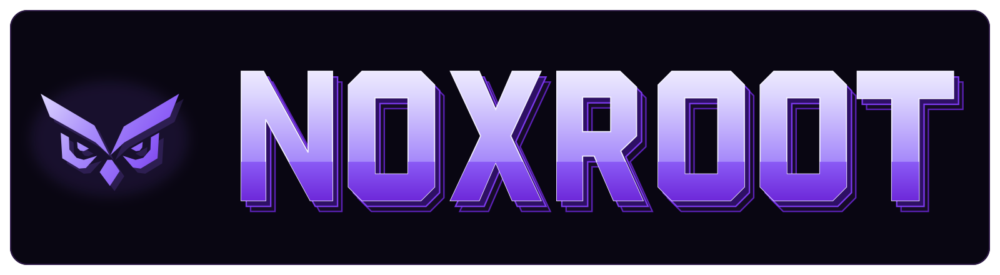

<p align="center">
  
</p>

<p align="center">
  <a href="https://github.com/liolevx/noxroot/actions/workflows/ci.yml"></a>
  <a href="LICENSE"></a>
</p>

# Noxroot

**The right repository context before a change. The right checks after it. Useful knowledge for the
next task.**

Set up Noxroot once. Then keep working with your coding agent normally.

Noxroot finds the instructions, docs, skills, and checks your repository already has. Before a code
change, it gives the agent a small task brief: what matters, what may change, and which checks
apply. After the change, it checks the real diff and proposes a Markdown update only when the
project learned something worth keeping. If another tool already owns part of the workflow, Noxroot
leaves it in charge.

## What Noxroot changes

| Without Noxroot                                        | With Noxroot                                                                        |
| ------------------------------------------------------ | ----------------------------------------------------------------------------------- |
| Each new session rediscovers the repository            | Every task starts from the same documented project knowledge                        |
| Too much code is loaded or an important file is missed | The agent gets a small, explainable task brief                                      |
| Checks are guessed, skipped, or reported vaguely       | Approved checks run against the actual diff                                         |
| Decisions and fixes disappear into old chats           | Useful lessons are proposed as Markdown and carried into future tasks once accepted |
| The workflow depends on one coding tool                | The core works through a CLI, Markdown, JSON, and a command adapter                 |

New chats do not require another `init`. Ordinary questions need no Noxroot task. Noxroot stays in
the background until code-changing work needs it.

When Noxroot owns the lifecycle, the workflow is:

<p align="center">
  
</p>

Noxroot prepares the task, your coding agent builds it, and Noxroot checks the result. Useful
lessons can become project documentation. Your coding agent stays in control.

## Project memory, not chat history

Project memory is the versioned repository knowledge future agents should reuse: architecture,
conventions, decisions, procedures, and validated lessons. It is stored as ordinary Markdown, not
model memory or chat history.

Noxroot starts with the repository's existing documentation and source. Its index points agents to
relevant material instead of copying it into a parallel wiki. Validated lessons keep project
documentation current. If no reusable lesson exists, nothing is added.

Because project knowledge is plain Markdown, you can inspect it in GitHub, your editor, or
optionally Obsidian. Raw prompts, application sessions, credentials, and user data do not become
project memory.

## Checks that match the change

During setup, Noxroot finds existing lint, type-check, test, build, and native eval commands. You
approve which may run. `finish` applies the relevant checks to the changed paths. Wider or sensitive
changes can require independent review.

Noxroot shows which files changed, which commands ran, what passed or failed, and anything it could
not verify. A missing relevant check produces `incomplete`, never `approved`. Inspect the exact plan
before it runs with `noxroot verify --plan`.

## Set up once

```bash
npx noxroot@latest init
```

Then keep talking to your coding agent normally:

```text
Add a page where users can save favourite restaurants.
```

For a code-changing task, compatible agents are instructed to use the pinned repository commands
behind the scenes:

```bash
npx --yes noxroot@0.1.0 start "add a page where users can save favourite restaurants"
# your existing coding agent builds the change
npx --yes noxroot@0.1.0 finish
```

Run `init` once per repository, not once per chat or day. It shows a read-only diagnosis, reuses
existing documentation, and proposes a thin managed entrypoint without replacing a good `AGENTS.md`
or copying documentation into a Noxroot-only format. The entrypoint pins the Noxroot version and
uses `npx`, so the repository needs no global or project installation. npm retrieves the CLI through
its normal cache when an agent invokes it.

Before setup, preview labels each capability `create`, `reuse`, `conflict`, or `not-assessed`.
Noxroot creates only a confirmed gap. Existing systems stay in place. Missing evidence means no
change. If another tool already coordinates repository changes, Noxroot can add non-overlapping
context and verification support while that tool keeps ownership of task lifecycle, review, and
learning. Noxroot will not install a second lifecycle beside it.

Questions, explanations, reviews, and other read-only work do not create tasks. If a new
conversation continues the same task in the same repository, branch, and worktree, `start` reuses
the active baseline instead of creating a duplicate. `finish` finds the task when exactly one
matches. If several tasks match, Noxroot lists them and requires `--task <id>` instead of guessing.
Instruction discovery varies by coding tool, so the commands remain available for manual use.

### What setup can add

| Surface                           | Actual path or command                                                                                      | Purpose                                                                    |
| --------------------------------- | ----------------------------------------------------------------------------------------------------------- | -------------------------------------------------------------------------- |
| Agent entrypoint and config       | `AGENTS.md`, `.noxroot/config.yml`                                                                          | Connect compatible agents to the project workflow                          |
| Project-memory index              | `.noxroot/knowledge/INDEX.md`                                                                               | Route agents to relevant existing documentation                            |
| Task-context routes               | `.noxroot/routes.yml`                                                                                       | Select relevant files, rules, tests, decisions, and skills                 |
| Verification policy and skill     | `.noxroot/verification.yml`, `.noxroot/skills/verify-change/SKILL.md`                                       | Define approved checks and the procedure for checking a change             |
| Review skills                     | `.noxroot/skills/independent-review/SKILL.md`, `.noxroot/skills/product-ux-review/SKILL.md` when applicable | Provide fresh review procedures when the change requires them              |
| Learning procedure after finish   | `finish`, then `learn` through the pinned `npx` command                                                     | Propose a small knowledge update when something reusable was validated     |
| Local task state created by start | `.git/noxroot/runs/*.json` in a standard checkout                                                           | Store baselines and results without treating them as project documentation |

Only missing capabilities are proposed. A mature repository may need only a small entrypoint and
configuration, or no setup changes at all.

`SKILL.md` files are portable, on-demand instructions. The generated verification skill tells an
agent how to check a change; the independent-review and optional product/UX skills describe their
reviews. Context loading comes from `AGENTS.md`, the knowledge index, and context routes, not a
generated context skill. Learning comes from `finish` and `learn`, not a generated learning skill.

Skills do not prove that code works. The actual tests, type checks, builds, evals, and review
results do. An incomplete result can be handed off locally, but it cannot become approved or qualify
for a future automatic merge. Noxroot does not push, merge, publish, or deploy.

## See what the agent gets

This tested example comes from Noxroot's own repository:

```text
$ noxroot context "improve reviewer decision safety"

Selected 6 of 116 repository files · ~3,230 tokens
Likely owner: src/adapters/agents.ts
Likely tests: tests/agent-review.test.ts
Approved checks: format-check, lint, typecheck, test, build
Deliberately excluded: 110 unrelated files
```

Selection is advisory, not permission to edit. "Do not deploy" remains an exclusion; it never
activates deployment work.

Completion stays compact:

```text
Changed
  3 navigation files

Checked
  TypeScript       passed
  Navigation tests passed

Review
  Not required for this bounded change

Learning
  No reusable project-knowledge candidate

Next
  Review the resulting change.
```

This transcript illustrates the stable information hierarchy; repository-specific commands and
counts come from the recorded run rather than fixed example data.

## Try the read-only diagnosis

Noxroot is not published to npm yet. From source, use Node.js `>=22.12 <27`:

```bash
git clone https://github.com/liolevx/noxroot.git
cd noxroot
npm ci
npm run build
node dist/cli.js preview --root tests/fixtures/typescript
```

The fixture produces this abbreviated output:

```text
NOXROOT PREVIEW
Detected: Node.js project, TypeScript (npm)
Approved check candidates found: lint, typecheck, test, build
Initialization allowed: yes
Mode: full
Capabilities:
- Project knowledge: create
- Task routes: create
- Verification: create
- Verification skill: create
- Task orchestration: create
- Product and UX guidance: not-assessed; missing evidence: No user-facing product surface was detected.
Proposed (7): create 7
Unknown: Continuous integration
Trust: files changed 0; repository commands 0; agent calls 0; network requests 0.

No repository files changed. No project command, agent, or network request ran.
Next: npx --yes noxroot@0.1.0 preview --diff
```

Use `preview --diff` to inspect every proposed setup patch. The intended beta entry point is
`npx noxroot@latest preview`.

## Portable by design

Noxroot's universal interface is the CLI plus generated Markdown and JSON. Any agent that can run a
command or read a task package can use it. The generic adapter accepts an explicit executable and
literal arguments. It does not guess vendor flags or use shell interpolation.

Instruction discovery varies by client. Some tools read `AGENTS.md`, others use their own files, and
some require manual invocation. Noxroot does not claim equal native integration everywhere.

Application-agent frameworks are detected project architectures, not competitors or dependencies.
Their tests and evals can become approved repository checks. Noxroot does not install or control
Agno, PydanticAI, Google ADK, LangGraph, or another application runtime. Project knowledge remains
separate from application runtime sessions, state, memory, and user data.

JavaScript package evidence supports npm, pnpm, Yarn, and Bun. Explicit verification arrays support
Python, Go, Rust, and other stacks. CI covers Windows, macOS, and Linux.

## Inspect the details when you need them

`preview --diff` shows proposed writes. `context` explains file selection. `verify --plan` shows
approved commands without running them. `verify --changed` runs applicable checks. `run --dry-run`
shows a connected execution plan. `doctor` explains configuration problems. `learn --task ID` shows
confirmable durable proposals. Data commands support `--json`, with progress and diagnostics on
standard error.

Read the [command reference](docs/commands.md), [configuration](docs/configuration.md),
[architecture](docs/architecture.md), [adapter protocol](docs/adapters.md), and
[security boundaries](docs/security.md).

Noxroot is an experimental v0.1 MVP. Apache-2.0; see [CONTRIBUTING.md](CONTRIBUTING.md),
[SECURITY.md](SECURITY.md), and [LICENSE](LICENSE).
