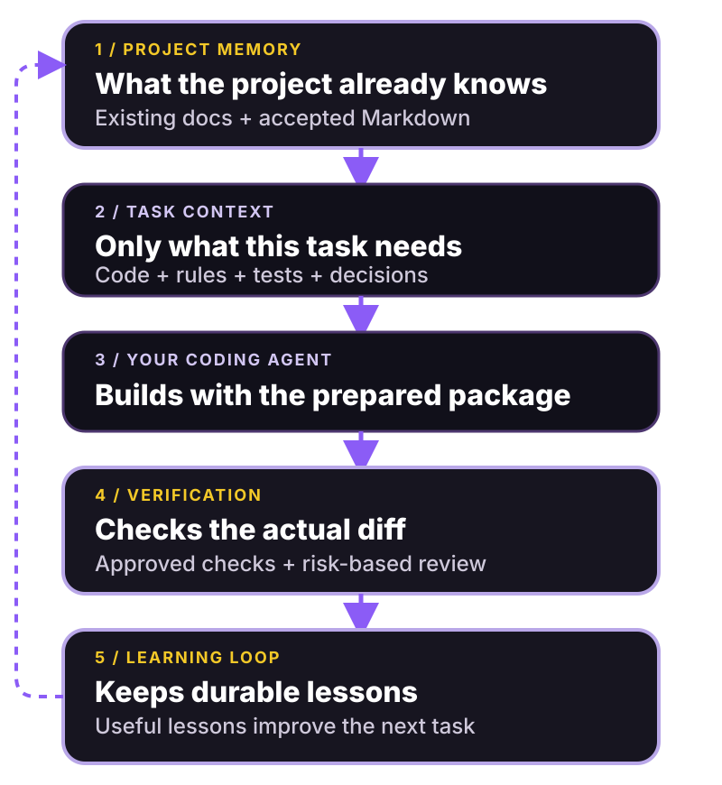

# Noxroot


Make your coding agent repo-aware—and keep it that way.

Noxroot is a lightweight, local workflow around the coding agent you already use. It maps the code,
documentation, tests, and conventions your agent needs; prepares a small task-specific context;
checks the actual change with the project’s own tools; and preserves only reusable project
knowledge. Noxroot contains no model and does not take ownership of your repository.

The goal is simple: repeat yourself less, catch more avoidable mistakes, and let a project remain
understandable as it grows. Experienced developers get inspectable paths, commands, policies, and
JSON without another ceremony. Intent-driven builders can describe an outcome in ordinary language
without first learning context budgets, worktrees, reviewer schemas, or architecture vocabulary.
Both use the same workflow; advanced detail appears only when requested.

By default, the output answers three questions: what changed, what was checked, and what needs
attention next. Paths, exact commands, exit codes, selection reasons, and policy remain one explicit
command away.

## See the useful part first

This example is produced from Noxroot’s own repository and locked to the documentation tests:

```text
$ noxroot context "improve reviewer decision safety"

Selected 6 of 110 repository files · ~3,272 tokens
Likely owner: src/adapters/agents.ts
Likely tests: tests/agent-review.test.ts (+1 related)
Approved checks: format-check, lint, typecheck, test, build
Deliberately excluded: 104 unrelated files
```

The selected package contains relevant instructions, source, tests, accepted decisions, and approved
checks—not a copy of the whole repository. Selection is advisory and explainable. It never becomes
permission to edit a file, and a phrase such as “do not deploy” remains an exclusion rather than
activating deployment work.



Noxroot works with your existing coding agent. It does not provide the model.

## One quiet workflow

Initialize once, then let a compatible coding agent use the repository instructions—or run the same
commands yourself:

```bash
npx noxroot init
noxroot start "add a page where users can save favourite restaurants"
# your existing coding agent performs the work
noxroot finish
```

`init` begins with a read-only diagnosis. It shows what was detected, which existing documentation
will be reused, every proposed file or patch, candidate commands that may later run, and four
zero-side-effect counters. Nothing changes until you confirm. Existing `AGENTS.md` content and good
project documentation are preserved; Noxroot adds a small managed entrypoint and references the
authoritative files instead of building a parallel wiki.

`start` records a clean baseline and reports the interpreted outcome, explicit exclusions, selected
context, estimated tokens, likely area, approved checks, whether an agent was invoked, and one next
action. Manual mode invokes no model. `run` remains available when an experienced user explicitly
configures a connected command adapter.

`finish` inspects the real Git diff and runs only approved checks that apply to changed paths. A
routine checked change can complete without an unnecessary reviewer. User-facing,
security-sensitive, or unusually broad diffs request fresh review. Missing or unavailable checks
produce an honest `incomplete` result: local handoff may continue, but the result is never approved
and Noxroot never turns the gap into permission to merge.

The completion step also performs a lightweight documentation and learning assessment. It reuses
structured reviewer candidates when review already happened and deterministic verification gaps when
they are genuinely reusable. Otherwise it says no update is needed. It does not call another model
merely to manufacture a lesson, save raw task text, or create a session summary.

The exact values vary by repository. A normal human-readable completion is intentionally compact:

```text
Changed
  3 navigation files

Checked
  TypeScript       passed
  Navigation tests passed

Review
  Not required for this bounded change

Learning
  No project-knowledge update needed

Next
  Review the resulting change.
```

This transcript illustrates the stable information hierarchy; repository-specific commands and
counts come from the recorded run rather than fixed example data.

## Try the read-only diagnosis

Noxroot is not published to npm yet. From the source repository, use Node.js `>=22.12 <27`:

```bash
git clone https://github.com/liolevx/noxroot.git
cd noxroot
npm ci
npm run build
node dist/cli.js preview --root tests/fixtures/typescript
```

The fixture produces this abbreviated output:

```text
NOXROOT PREVIEW
Detected: Node.js project, TypeScript (npm)
Approved check candidates found: lint, typecheck, test, build
Proposed (7): create 7
Unknown: Continuous integration
Trust: files changed 0; repository commands 0; agent calls 0; network requests 0.

No repository files changed. No project command, agent, or network request ran.
Next: noxroot preview --diff
```

Use `preview --diff` to inspect exact setup patches. The intended public-beta entry point is
`npx noxroot@latest preview`; npm distributes the CLI, but Noxroot can inspect repositories using
other languages and build systems.

## Works with your tools in layers

The universal contract is the CLI, generated Markdown/JSON, and a portable task package. Any coding
agent that can execute the CLI or read those files can use that baseline. A generic connected mode
accepts an explicit executable plus literal argument array, reads one bounded JSON package on
standard input, and uses no shell interpolation or guessed vendor flags.

Native instruction discovery varies by client. Codex and several other tools read `AGENTS.md`;
Claude Code primarily uses `CLAUDE.md`; other clients have their own conventions. Noxroot reuses
standard project files where supported and falls back to the universal package. It does not claim
equal native integration with Codex, Claude Code, Cursor, OpenCode, or every future tool.

Application-agent frameworks are detected project architectures, not Noxroot competitors or required
dependencies. Their native tests and evals may become approved checks, but the MVP does not install
or control Agno, PydanticAI, Google ADK, LangGraph, or another application runtime. Noxroot project
knowledge remains strictly separate from application runtime sessions, state, memory, and user data.

JavaScript package-manager evidence supports npm, pnpm, Yarn, and Bun. Explicit verification arrays
support Python, Go, Rust, and other stacks. CI tests Node 24 on Windows, macOS, and Linux, plus Node
22 and 26 package smokes on Linux.

## Inspect more when you want it

The beginner path is `init`, `start`, and `finish`. Advanced surfaces remain ordinary commands:
`preview --diff` shows proposed writes; `context` explains selection; `verify --plan` shows approved
commands without running them; `verify --changed` runs applicable checks; `run --dry-run` exposes a
connected execution plan; `doctor` explains configuration problems; and `learn --task ID` shows
confirmable durable proposals. Every data command supports `--json`, with progress and diagnostics
kept on standard error.

Read the [command reference](docs/commands.md), [configuration](docs/configuration.md),
[architecture](docs/architecture.md), [adapter protocol](docs/adapters.md), and
[security boundaries](docs/security.md) for the complete contracts. The documentation stays as
GitHub-native Markdown for now; the current set is too small to justify a separate site framework.

Noxroot is an experimental v0.1 MVP. It does not push, merge, publish, deploy, store conversations,
run a daemon, add telemetry, or silently authorize worker-created checks. Apache-2.0; see
[CONTRIBUTING.md](CONTRIBUTING.md), [SECURITY.md](SECURITY.md), and [LICENSE](LICENSE).
